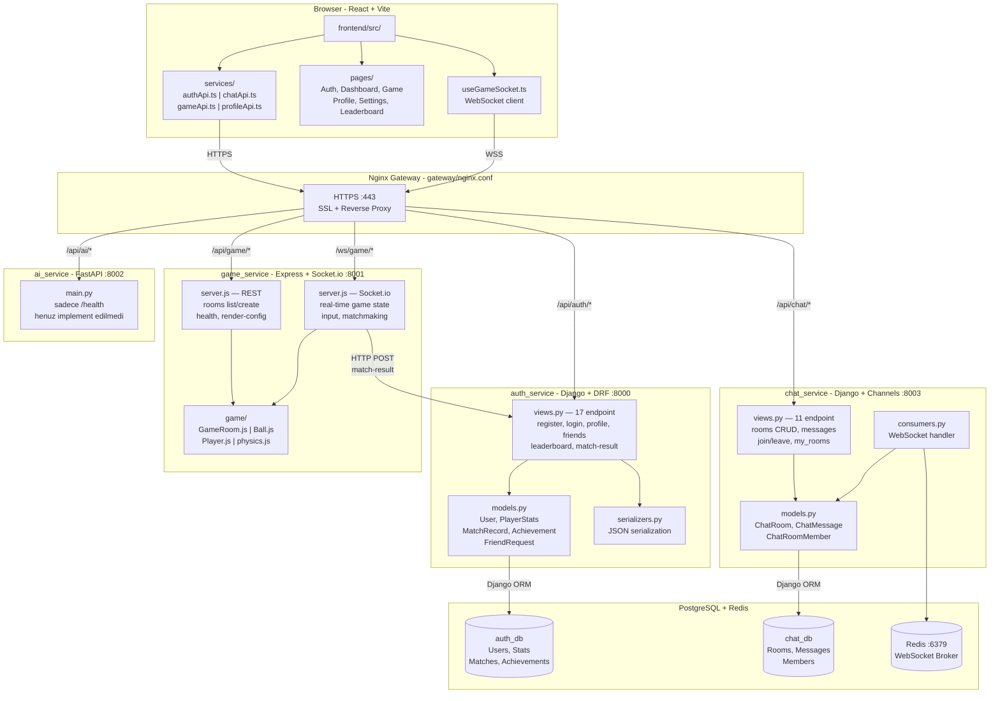

# ft_transcendence

**Proje:** Web-Based Multiplayer Haxball Oyunu
**Mimari:** Microservices (Docker)
**Tech Stack:** React (Frontend) | Django & Node.js (Backend) | PostgreSQL (DB) | Nginx (Gateway) | Redis (WebSocket Broker)

---

## Mimari

Proje 6 ana servis + 1 veritabani + 1 cache/broker olarak Docker container'larinda calisir.
Tum servisler tek bir PostgreSQL instance'i uzerindeki ayni veritabanina (`ft_transcendence`) baglanir.



### Servisler

| # | Servis | Teknoloji | Port | Rol |
|---|--------|-----------|------|-----|
| 1 | **Gateway** | Nginx 1.25 | 80, 443 | Reverse proxy, SSL, routing |
| 2 | **Frontend** | React 18 | 80 (internal) | SPA, oyun arayuzu |
| 3 | **Auth Service** | Django 5 + DRF + Gunicorn | 8000 | Kayit, giris, JWT, profil |
| 4 | **Game Service** | Node.js + Express + Socket.io | 8001 | Haxball oyun motoru, WebSocket |
| 5 | **Chat Service** | Django 5 + Channels + Daphne | 8003 | Sohbet, DM, WebSocket |
| 6 | **AI Service** | FastAPI + Uvicorn | 8002 | Avatar kontrolu, mesaj moderasyonu |
| 7 | **PostgreSQL** | PostgreSQL 16 | 5432 | Tek DB — auth, game, chat tablolari |
| 8 | **Redis** | Redis 7 | 6379 | WebSocket broker (Django Channels) |

### Nginx Routing

| Path | Hedef |
|------|-------|
| `/` | Frontend (React SPA) |
| `/api/auth/*` | Auth Service |
| `/api/game/*` | Game Service |
| `/api/chat/*` | Chat Service |
| `/api/ai/*` | AI Service |
| `/ws/game/*` | Game Service (WebSocket) |
| `/ws/chat/*` | Chat Service (WebSocket) |
| `/media/*` | Statik dosyalar (avatarlar) |

---

## Kurulum

### Gereksinimler
- Docker & Docker Compose
- Make

### Hizli Baslangic

```bash
# 1. Repo'yu klonla
git clone <repo-url>
cd ft_transcendence

# 2. Environment dosyasini olustur
cp env.example .env

# 3. Tum servisleri baslat (SSL + build + start)
make
```

Tarayicidan `https://localhost` adresini ac.

### Environment Degiskenleri (.env)

| Degisken | Aciklama | Varsayilan |
|----------|----------|------------|
| `DOMAIN` | Site domain'i | `localhost` |
| `DJANGO_SECRET_KEY` | Django secret key | `dev-secret-key-not-for-production` |
| `DEBUG` | Debug modu (1=acik, 0=kapali) | `1` |
| **PostgreSQL** | | |
| `POSTGRES_DB` | Veritabani adi — tum servisler bunu kullanir | `ft_transcendence` |
| `POSTGRES_USER` | DB kullanici adi | `ft_user` |
| `POSTGRES_PASSWORD` | DB sifresi | `devpassword` |
| `POSTGRES_HOST` | DB host (docker service adi) | `postgres` |
| `POSTGRES_PORT` | DB port | `5432` |
| **Redis** | | |
| `REDIS_HOST` | Redis host | `redis_broker` |
| `REDIS_PORT` | Redis port | `6379` |
| `REDIS_PASSWORD` | Redis sifresi | `devpassword_redis` |
| **JWT** | | |
| `JWT_SECRET_KEY` | Token imzalama anahtari | `dev-jwt-secret-key` |
| `JWT_ACCESS_TOKEN_LIFETIME_MINUTES` | Access token suresi (dk) | `60` |
| `JWT_REFRESH_TOKEN_LIFETIME_DAYS` | Refresh token suresi (gun) | `7` |
> **Not:** Tek PostgreSQL container'i kullaniliyor. `POSTGRES_DB`, `POSTGRES_USER`, `POSTGRES_PASSWORD` degiskenleri hem container'in kendisi hem de auth/chat/game servisleri tarafindan ortaklanir. Tum tablolar Django migrations ile yonetilir.

### Komutlar

| Komut | Aciklama |
|-------|----------|
| `make` | SSL + build + start |
| `make up` | Servisleri baslat |
| `make down` | Servisleri durdur |
| `make restart` | Yeniden baslat |
| `make logs` | Tum loglari goruntule |
| `make logs-<servis>` | Tek servis logu (or: `make logs-auth_service`) |
| `make clean` | Container, volume, image hepsini sil |
| `make status` | Container durumlarini goster |
| `make migrate-auth` | Auth DB migration |
| `make migrate-chat` | Chat DB migration |
| `make test` | Tum auth testlerini calistir |
| `make test-auth T=test_login` | Belirli test dosyasini calistir |
| `make superuser` | Django superuser olustur |

---

## Public API

Auth Service uzerinden REST API sunulmaktadir. Tum endpoint'ler `/api/auth/` altindadir.

### HTTP Method'lar

| Method | Endpoint | Aciklama |
|--------|----------|----------|
| **GET** | `/api/auth/profile/` | Kullanici profili |
| **GET** | `/api/auth/users/<id>/` | Public kullanici bilgisi |
| **GET** | `/api/auth/users/<id>/stats/` | Oyuncu istatistikleri |
| **GET** | `/api/auth/users/<id>/matches/` | Mac gecmisi |
| **GET** | `/api/auth/users/<id>/achievements/` | Basarimlar |
| **GET** | `/api/auth/friends/` | Arkadas listesi |
| **GET** | `/api/auth/leaderboard/` | Skor tablosu |
| **POST** | `/api/auth/register/` | Yeni kullanici kaydi |
| **POST** | `/api/auth/login/` | Giris + JWT token |
| **POST** | `/api/auth/logout/` | Cikis + token blacklist |
| **POST** | `/api/auth/friends/add/` | Arkadas ekle |
| **POST** | `/api/auth/token/refresh/` | JWT token yenile |
| **PUT** | `/api/auth/profile/avatar/` | Avatar yukle |
| **PUT** | `/api/auth/password/change/` | Sifre degistir |
| **DELETE** | `/api/auth/friends/<user_id>/` | Arkadas cikar |

### Authentication

JWT Bearer Token ile korunmaktadir. Login/register sonrasi `access` ve `refresh` token donulur.

```
Authorization: Bearer <access_token>
```

### Rate Limiting

Tum endpoint'lere rate limiting uygulanmaktadir:

| Kullanici Tipi | Limit |
|----------------|-------|
| Anonim (login olmamis) | 30 istek / dakika |
| Authenticated (login olmus) | 100 istek / dakika |

Limit asildiginda `429 Too Many Requests` + `Retry-After` header donulur.

---

## AI Service

Icerik moderasyonu icin FastAPI tabanli AI servisi. Docker internal network uzerinden diger servislerden erisilebilir.

### Endpoint'ler

| Method | Endpoint | Aciklama |
|--------|----------|----------|
| **GET** | `/api/ai/health` | Servis sagligi |
| **POST** | `/api/ai/moderate/text` | Metin kufur filtreleme |
| **POST** | `/api/ai/moderate/image` | Gorsel NSFW tespiti |

### Metin Moderasyonu

**Kufur filtreleme** — `better_profanity` kutuphanesi + ozel Turkce kelime listesi.

```bash
curl -X POST https://localhost/api/ai/moderate/text \
  -H "Content-Type: application/json" \
  -d '{"text": "ornek mesaj"}'
```

**Response:**
```json
{
  "flagged": false,
  "original": "ornek mesaj",
  "censored": "ornek mesaj"
}
```

Kufur tespit edilirse `flagged: true` doner ve `censored` alaninda sansurlu hali bulunur.

Desteklenen diller:
- **Ingilizce**: Dahili sozluk (~1600 kelime, leetspeak varyasyonlari dahil)
- **Turkce**: Ozel `wordlists/tr_profanity.txt` dosyasi (~130 kelime)

### Gorsel Moderasyonu

**NSFW tespiti** — `Falconsai/nsfw_image_detection` modeli (Vision Transformer).

```bash
curl -X POST https://localhost/api/ai/moderate/image \
  -F "file=@resim.jpg"
```

**Response:**
```json
{
  "safe": true,
  "nsfw_score": 0.03,
  "normal_score": 0.97,
  "label": "normal"
}
```

`nsfw_score >= 0.7` ise `safe: false` ve `label: "nsfw"` doner.

---

## Test Suite

### Auth Service Testleri

```bash
# Tum auth testlerini calistir
make test

# Belirli bir test dosyasi
make test-auth T=test_login
```

Mevcut test dosyalari (`auth_service/auth_app/tests/`):

| Dosya | Kapsam |
|-------|--------|
| `test_register.py` | Kullanici kaydi, validasyon, duplicate kontrol |
| `test_login.py` | Giris, yanlis sifre, JWT token |
| `test_logout.py` | Cikis, token blacklist |
| `test_profile.py` | Profil goruntuleme, guncelleme |
| `test_password.py` | Sifre degistirme, validasyon |
| `test_friends.py` | Arkadas ekleme, cikarma, listeleme |

### AI Service Testleri

```bash
# Container icinden calistir
docker-compose exec ai_service pytest -v

# Sadece metin moderasyonu
docker-compose exec ai_service pytest tests/test_moderation.py -v

# Sadece gorsel moderasyonu
docker-compose exec ai_service pytest tests/test_image.py -v

# Sadece API endpoint'leri
docker-compose exec ai_service pytest tests/test_api.py -v
```

AI test dosyalari (`ai_service/tests/`):

| Dosya | Test Sayisi | Kapsam |
|-------|-------------|--------|
| `test_moderation.py` | 15 | Turkce kufur tespiti, Ingilizce kufur tespiti, temiz metin, sansur dogrulugu, edge case'ler (bos string, None, uzun metin) |
| `test_image.py` | 5 | Normal resim safe doner, response format kontrolu, nsfw_score araligi, gecersiz dosya, bos dosya |
| `test_api.py` | 6 | GET /health, POST /moderate/text (temiz + kufur), POST /moderate/image (gecerli + dosyasiz), 422 validation hatalari |

---

## Veritabani Yapisi

Tek PostgreSQL instance, tek `ft_transcendence` veritabani:

```
ft_transcendence (PostgreSQL)
├── Auth tablolari (Django migrations)
│   ├── auth_app_user — kullanici, profil, arkadas listesi
│   ├── auth_app_playerstats — oyuncu istatistikleri
│   ├── auth_app_matchrecord — mac kayitlari
│   ├── auth_app_matchplayer — mac oyunculari
│   ├── auth_app_achievement — basarimlar
│   └── auth_app_userachievement — kazanilan basarimlar
└── Chat tablolari (Django migrations)
    ├── chat_app_chatroom — sohbet odalari
    ├── chat_app_chatmessage — mesajlar
    └── chat_app_chatroommember — oda uyeleri
```

---

## Proje Yapisi

```
ft_transcendence/
├── gateway/              # Nginx reverse proxy
│   ├── Dockerfile
│   └── nginx.conf
├── frontend/             # React SPA
│   ├── Dockerfile
│   ├── nginx.conf
│   ├── src/
│   └── package.json
├── auth_service/         # Django - Auth & User
│   ├── Dockerfile
│   ├── auth_project/     # Django settings
│   ├── auth_app/         # App logic
│   │   ├── models.py     # User modeli
│   │   ├── views.py      # Register, Login, Friends
│   │   ├── serializers.py
│   │   └── tests/        # Test suite
│   └── requirements.txt
├── game_service/         # Node.js - Game Engine
│   ├── Dockerfile
│   ├── server.js         # Express + Socket.io server
│   ├── package.json
│   └── game/             # Oyun motoru
│       ├── GameRoom.js   # Oda yonetimi, skor, reset
│       ├── Player.js     # Oyuncu fizigi, input
│       ├── Ball.js       # Top fizigi
│       └── physics.js    # Carpisma, vurus, momentum
├── chat_service/         # Django Channels - Chat
│   ├── Dockerfile
│   ├── chat_project/     # Django settings
│   ├── chat_app/         # App logic
│   └── requirements.txt
├── ai_service/           # FastAPI - AI Moderation
│   ├── Dockerfile
│   └── app/main.py
├── ssl/                  # SSL sertifikalari (gitignore)
├── docker-compose.yml
├── Makefile
├── env.example
└── generate_ssl.sh
```

---

## Gelistirme Yol Haritasi

### Adim 1: Altyapi
- [x] Docker Compose ile tum servisleri ayaga kaldir
- [x] Nginx gateway (SSL, routing, WebSocket)
- [x] PostgreSQL veritabani (tek instance)
- [x] Redis broker
- [x] database/init.sql ile tablo semalari

### Adim 2: Kullanici Yonetimi
- [x] User modeli (email, avatar, online_status, friends)
- [x] JWT authentication (login, register, refresh, logout)
- [x] Profil ve avatar yonetimi
- [x] Sifre degistirme
- [x] Arkadas ekleme/cikarma
- [x] Auth test suite (23 test)

### Adim 3: Oyun Cekirdegi
- [x] Socket.io ile client-server iletisimi
- [x] 60 FPS server-side game loop (30 FPS network broadcast)
- [x] Fizik motoru (top, oyuncu, carpisma)
- [x] Client tarafinda Canvas render
- [ ] JWT token ile oyuncu dogrulama
- [ ] Mac sonucu kaydetme

### Adim 4: Oda ve Eslestirme
- [ ] Room ID ile oda olusturma/katilma
- [ ] Harita secimi

### Adim 5: Chat ve Sosyal
- [ ] WebSocket ile gercek zamanli sohbet
- [ ] DM, kanal sistemi
- [ ] AI mesaj moderasyonu

### Adim 6: Istatistikler
- [ ] Mac gecmisi kaydetme
- [ ] Skor tablosu
- [ ] Achievements

### Adim 7: Cila
- [ ] Avatar AI kontrolu
- [ ] UI/UX iyilestirmeleri
- [ ] Son testler
